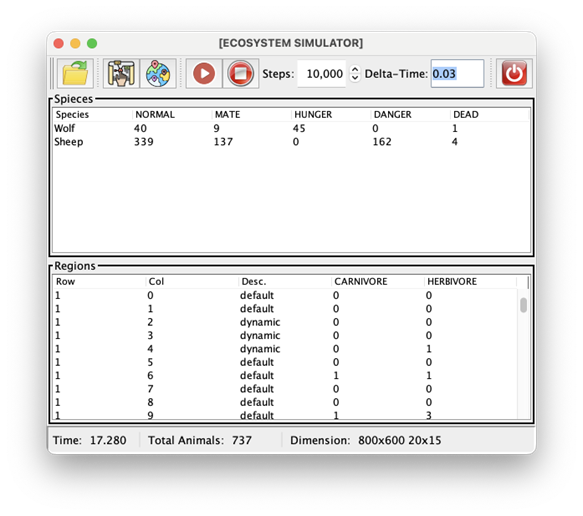
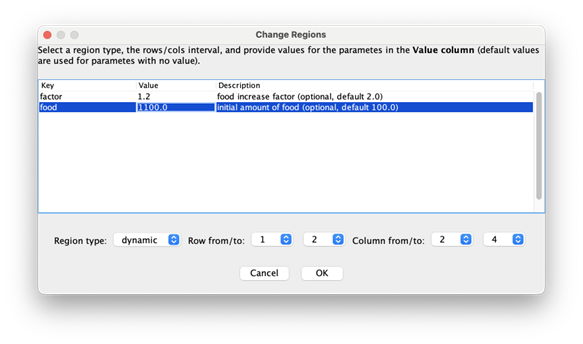
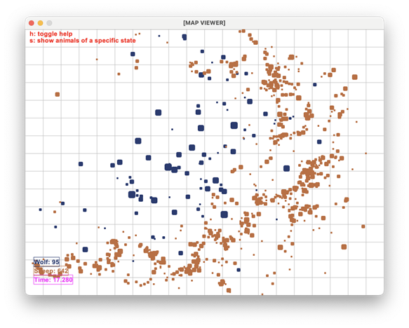

# Assignment 2: Graphical User Interface for the Ecosystem Simulator

**Objective:** Object-oriented design, Model-View-Controller, graphical user interfaces with Swing.

**Delivery date:** April 20, 2026, 09:00h

## Copy Control

For each of the TP2 assignments, all the submissions from all the
different TP2 groups will be checked using anti-plagiarism software,
by comparing them all pairwise and by searching to see if any of the
code of any of them is copied from other sources on the Internet
or previous years assignment. Any plagiarism detected will be treated
as a grade of zero for the TP2-course exam session (*convocatoria*) to
which the assignment belongs.

If you decide to store your code in a remote repository, e.g. in a
free version-control system with a view to facilitating collaboration
with your lab partner, make sure your code is not in reach of search
engines. If you are asked to provide your code by anyone other than
your course lecturer, e.g. an employer of a private academy, you must
refuse.

## General Instructions

The following instructions are **strict**, meaning **you must follow them strictly**.

1. Read the full assignment description before starting.
2. Make a copy of assignment 1 before making changes to it for assignment 2.
3. Create a new package `simulator.view` to place all the view classes in it.
4. It is necessary to use exactly the same package structure and the same class names that appear in the description.
5. The use of any tool for the automatic generation of graphical user interfaces is not allowed.
6. Download [extra.zip](./extra.zip) and unzip it in the `src` folder (it includes `JTable` and `JDialog` examples).
7. Download [ViewUtils.java](./ViewUtils.java), [AbstractMapViewer.java](./AbstractMapViewer.java) and [MapViewer.java](./MapViewer.java) and copy them to the `simulator.view` package.
8. Download [icons.zip](/icons.zip) and unzip it in the `resources` folder to have a `resources/icons` folder where the icons are. Using another folder for the icons is not allowed.
9. Do not print errors with `System.out` or with the exception's `printStackTrace()`; all errors must be shown using `ViewUtils.showErrorMsg`.
10. When you submit the assignment, upload a file named **src.zip** that includes only the **src** folder. Calling it by another name or using **7zip**, **rar**, etc., is not allowed. If you use additional icons, the `resources/icons` folder can be included as long as the total size of the **zip** does not exceed **100k**.

## General Description of the Simulator's Graphical Interface

In this assignment, you are going to develop a graphical user interface (GUI) for the ecosystem simulator following the Model-View-Controller (MVC) design pattern. In the [Figures](#figures) section, you can see the GUI to be built. It is composed of a main window containing four components: (1) a control panel to interact with the simulator; (2) a table showing information about the species and their state; (3) a table showing the state of all regions; and (4) a status bar displaying more information, which we will detail later. In addition, it includes a dialog that allows changing regions, and a window (which opens separately) to draw the simulation state (similar to the viewer you used in the first assignment).

See [demo.mp4](./demo.mp4)

## Changes in the Model and Controller

This section describes the changes to be made in the model and controller to use the MVC design pattern and add some extra functionality.

### `reset` Method in the `Simulator` class

Add the following method to the `Simulator` class (if you don't have it already):

`public void reset(int cols, int rows, int width, int height)`: empties the animal list (or creates a new one), creates a new `RegionManager` with the appropriate size, and sets the time to `0.0`.

### `toString()` Method in the region classes

Add a `toString()` method to all classes extending the `Region` class that returns a short corresponding description, for example:

* `DefaultRegion`
* `DynamicRegion`

This information will be used in the GUI to show a region's description.

### The `fillInData` method of the builders

Complete the `fillInData` method in all builders so that it fills in the corresponding information (at least do it for the region builders, we will not use the rest for now). For example, `getInfo()` of the region builders will have to return the following JSONs:

```json
 {
   "type": "default",
   "desc": "Infinite food supply",
   "data": {}
 }

```

```json
 {
   "type": "dynamic",
   "desc": "Dynamic food supply",
   "data": {
     "factor": "food increase factor (optional, default 2.0)",
     "food": "initial amount of food (optional, default 100.0)"
   }
 }

```

You can do the same with the animal builders (although it is not necessary for this assignment).

### Region Iterator in the `RegionManager` class

Our goal is to provide access to regions from outside the model, in such a way that their states cannot be altered.

We start with modifying the `RegionInfo` interface to allow access to the animal list as `List<AnimalInfo>` instead of `List<Animal>`:

```java
public interface RegionInfo extends JSONable {
  public List<AnimalInfo> getAnimalsInfo();
}

```

In the `Region` class, the corresponding method will be:

```java
public List<AnimalInfo> getAnimalsInfo() {
  return new ArrayList<>(animals); // You can use Collections.unmodifiableList(animals);
}

```

Both options in the `return` line are valid; the first is safe for concurrent programming while the second is not (this is important for the third assignment).

> [!Note]
> Very important exercise (not to be submitted, simply to understand): explain why
> `return animals` does not compile, while the options above do compile.

Now we are going to modify the `RegionManager` class to have an iterator that allows iterating over the regions.

> [!Important]
> it is forbidden to add a `getRegion(int row, int col)` method to query
> the region at position `(row,col)` from the outside; it is mandatory to do it with an iterator to practice iterators.

We start by modifying the `MapInfo` interface to include a record of information about the regions and implement the `Iterable` interface:

```java
public interface MapInfo extends JSONable, Iterable<MapInfo.RegionData> {
  public record RegionData(int row, int col, RegionInfo r) {
  }
  // The rest of the interface is as before
}

```

The `RegionData` record simply includes the region's position and the region as `RegionInfo` instead of as `Region`, to ensure its state is not altered from the outside.

Now implement a corresponding iterator in the `RegionManager` class that traverses the region matrix (by rows, from left to right) and for each region returns a corresponding instance of `RegionData`.

### The `EcoSysObserver` interface

Observers implement the following interface, which includes various types of notifications (place it in the `simulator.model` package):

```java
public interface EcoSysObserver {
  void onRegister(double time, MapInfo map, List<AnimalInfo> animals);
  void onReset(double time, MapInfo map, List<AnimalInfo> animals);
  void onAnimalAdded(double time, MapInfo map, List<AnimalInfo> animals, AnimalInfo a);
  void onRegionSet(int row, int col, MapInfo map, RegionInfo r);
  void onAdvance(double time, MapInfo map, List<AnimalInfo> animals, double dt);
}

```

The method names provide information about the meaning of the events they notify. Regarding the parameters: `map` is the region manager; `animals` is the animal list; `a` is an animal, `r` is a region, `time` is the current simulation time, and `dt` is the `delta-time` used in the corresponding simulation step. Note that we use the types `MapInfo`, `AnimalInfo` and `RegionInfo` instead of `Animal`, `RegionManager` and `Region` to disallow altering the state of the corresponding objects from outside the simulation.

Modify the `Simulator` class to implement `Observable<EcoSysObserver>` where the `Observable<T>` interface is defined as:

```java
public interface Observable<T> {
  void addObserver(T o);
  void removeObserver(T o);
}

```

Add a list of observers to the `Simulator` class, initially empty, and add the following methods to register/remove observers:

1. `public void addObserver(EcoSysObserver o)`: adds the observer `o` to the observer list, if it is not already in it.
2. `public void removeObserver(EcoSysObserver o)`: removes the observer `o` from the observer list.

### Sending notifications

Modify the `Simulator` class to send notifications as described below:

1. At the end of the `addObserver` method, send an `onRegister` notification **only to the observer that just registered**, to pass the simulator's current state.
2. At the end of the `reset` method, send an `onReset` notification to **all observers**.
3. At the end of the `addAnimal` method, send an `onAnimalAdded` notification to **all observers**.
4. At the end of the `setRegion` method, send an `onRegionSet` notification to **all observers**.
5. At the end of the `advance` method, send an `onAdvance` notification to **all observers**.

Note that the animal list must be passed as `List<AnimalInfo>` to the observers. This can be done using `new ArrayList<>(animals)` or `Collections.unmodifiableList(animals)`, the difference between the two ways was explained earlier. For example, the `advance` notification can be done using the following method:

```java
private void notifyOnAdvance(double dt) {
  List<AnimalInfo> animals = new ArrayList<>(animals);
  // For each observer 'o', invoke o.onAdvance(time, regionMngr, animals, dt)
}

```

### Changes in the `Controller` class

The `Controller` class needs to be extended with additional functionality (to avoid passing the simulator to the GUI) as follows:

1. `public void reset(int cols, int rows, int width, int height)`: calls the simulator's `reset`.
2. `public void setRegions(JSONObject rs)`: assuming `rs` is a `JSON` structure that includes the "regions" key (as in the first assignment), modifies the corresponding regions using the simulator's `setRegion`. You must refactor the `loadData` code so there is no code duplication (because `loadData` already did something similar).
3. `public void advance(double dt)`: calls the simulator's `advance`.
4. `public void addObserver(EcoSysObserver o)`: calls the simulator's `addObserver`.
5. `public void removeObserver(EcoSysObserver o)`: calls the simulator's `removeObserver`.

### Public factories and delta-time in the `Main` class

In the `Main` class, make the attributes corresponding to the factories and the delta-time public because they will be used from the GUI.

## The Graphical User Interface

In this section, we will describe the different classes of our GUI.

### Main Window

The main window is represented by the following class. Read the code and complete the unimplemented parts. Instead of `BoxLayout`, you can use `GridBagLayout` or `GridLayout`.

```java
public class MainWindow extends JFrame {

  private Controller ctrl;

  public MainWindow(Controller ctrl) {
    super("[ECOSYSTEM SIMULATOR]");
    this.ctrl = ctrl;
    initGUI();
  }

  private void initGUI() {
    JPanel mainPanel = new JPanel(new BorderLayout());
    setContentPane(mainPanel);

    // TODO create a ControlPanel and add it to PAGE_START of mainPanel

    // TODO create a StatusBar and add it to PAGE_END of mainPanel

    // A pabel for the tables (it uses vertical BoxLayout)
    JPanel contentPanel = new JPanel();
    contentPanel.setLayout(new BoxLayout(contentPanel, BoxLayout.Y_AXIS));
    mainPanel.add(contentPanel, BorderLayout.CENTER);

    // TODO create the species table and add it to contentPanel.
    //      Use setPreferredSize(new Dimension(500, 250)) to set the size.

    // TODO Create the regions table and add it to contentPanel.
    //      Usa setPreferredSize(new Dimension(500, 250)) to set the size.

    // TODO call ViewUtils.quit(MainWindow.this) in the windowClosing method.
    addWindowListener(...);

    setDefaultCloseOperation(DO_NOTHING_ON_CLOSE);
    pack();
    setVisible(true);
   }
}

```

### Control Panel

The control panel is responsible for the interaction between the user and the simulator. It corresponds to the toolbar at the top of the window (see the [Figures](#figures) section). It includes the following components: buttons to interact with the simulator, a `JSpinner` to select the desired simulation steps, and a `JTextField` to update the delta-time. The initial value that must appear in the delta-time is that of the corresponding attribute in the `Main` class.

```java
class ControlPanel extends JPanel {

  private Controller ctrl;
  private ChangeRegionsDialog changeRegionsDialog;

  private JToolBar toolaBar;
  private JFileChooser fc;
  private boolean stopped = true; // used for the buttons run/stop
  private JButton quitButton;

  // TODO add fields here

  ControlPanel(Controller ctrl) {
    this.ctrl = ctrl;
    initGUI();
  }

  private void initGUI() {
    setLayout(new BorderLayout());
    toolaBar = new JToolBar();
    add(toolaBar, BorderLayout.PAGE_START);

    // TODO create the different widgets (buttons, etc.) and add them to toolaBar.
    //      All of them must have their corresponding tooltip. You can use
    //      this.toolaBar.addSeparator() to add the vertical separator line
    //      between the components that need it.

    // Quit Button
    this.toolaBar.add(Box.createGlue()); // this aligns the button to the right
    this.toolaBar.addSeparator();
    this.quitButton = new JButton();
    this.quitButton.setToolTipText("Quit");
    this.quitButton.setIcon(new ImageIcon("resources/icons/exit.png"));
    this.quitButton.addActionListener((e) -> ViewUtils.quit(this));
    this.toolaBar.add(quitButton);

    // TODO Initialize this.fc with an instance of JFileChooser. To make it always
    //      open in the examples folder you can use:
    //
    //      this.fc.setCurrentDirectory(new File(System.getProperty("user.dir") + "/resources/examples"));
   
    // TODO Initialize this.changeRegionsDialog with a corresponding instance.

  } 
  // TODO The rest of methods.
}

```

The functionality of the different buttons is as follows:

- When the  button is pressed: (1) use `this.fc.showOpenDialog(ViewUtils.getWindow(this))` to open the file chooser so the user can select the input file; (2) if the user has selected a file, load it as a `JSONObject`, reset the simulator using `this.ctrl.reset(...)` with corresponding parameters, and load the json using `this.ctrl.loadData(...)`.
- When the  button is pressed, it creates an instance of `MapWindow` (description below). This allows the user to see a visual representation of the simulation. Keep in mind that the user can have several viewers open at the same time.
- When the  button is pressed, it calls `this.changeRegionsDialog.open(ViewUtils.getWindow(this))` to open the regions dialog (remember that the instance is created only once in the constructor).
- When the  is pressed (1) it disables all buttons except the stop button , and changes the value of the `this.stopped` attribute to `false`; (2) gets the delta-time value from the corresponding `JTextField`; and (3) calls the `runSim` method with the current value of steps, specified in the corresponding `JSpinner`:

    ```java
    private void runSim(int n, double dt) {
      if (n > 0 && !this.stopped) {
        try {
          this.ctrl.advance(dt);
          SwingUtilities.invokeLater(() -> runSim(n - 1, dt));
        } catch (Exception e) {
          // TODO call ViewUtils.showErrorMsg with the appropriate
          //      error message
    
          // TODO enable all buttons
             this.stopped = true;
        }
      } else {
        // TODO enable all buttons
           this.stopped = true;
      }
    }
    ```

   You must complete the `runSim` method as indicated in the comments. Notice that the `runSim` method as defined guarantees that the interface will not freeze. To understand this behavior, modify `runSim` to include only `for(int i=0;i<n;i++) this.ctrl.advance(dt)` -- now, when starting the simulation, you will not see the intermediate steps, only the final state, plus the interface will be completely blocked.

- When the  button is pressed, update the value of the `this.stopped` attribute to `true`. This will "stop" the `runSim` method if there are calls in the swing event queue (observe the condition of the `runSim` method).
- The functionality of the  is provided as part of the code.

>[!Important]
> You must catch all possible exceptions thrown by the controller/simulator and show the corresponding message using `ViewUtils.showErrorMsg`. Do not print errors with `System.out` or `System.err`, nor with `stackTrace()` of the exception.

### Status Bar

The status bar is responsible for displaying general information about the simulator. It corresponds to the area at the bottom of the window (see the [Figures](#figures) section). Read the code and complete the missing parts. It is mandatory to add the simulation time, the total number of animals, and the simulation dimension (width, height, rows, and columns). You can add more information if you wish. Update the different values from the `EcoSysObserver` methods when necessary.

```java
class StatusBar extends JPanel implements EcoSysObserver {

  // TODO Add necessary fields.

  StatusBar(Controller ctrl) {
    initGUI();
    // TODO Register the 'this' object as an observer.
  }

  private void initGUI() {
    this.setLayout(new FlowLayout(FlowLayout.LEFT));
    this.setBorder(BorderFactory.createBevelBorder(1));

    // TODO Create several JLabels for the time, the number of animals, and the
    //      dimension and add them to the panel. You can use the following code
    //      to add a vertical separator:
    //
    //     JSeparator s = new JSeparator(JSeparator.VERTICAL);
    //     s.setPreferredSize(new Dimension(10, 20));
    //     this.add(s);
  }

  // TODO The rest of methods.
}

```

### Information Tables

The tables are responsible for displaying the animal/region information. We will have an `InfoTable` class that includes a `JTable` and will receive the corresponding table model as a parameter. For this, we will also have two classes `SpeciesTableModel` and `RegionsTableModel` for the species and region table models, respectively.

Since the tables have common parts, we are going to define a class that represents a table that receives the table model (which includes the data) as a parameter and use it for both tables:

```java
public class InfoTable extends JPanel {

  private String title;
  TableModel tableModel;

  InfoTable(String title, TableModel tableModel) {
    this.title = title;
    this.tableModel = tableModel;
    initGUI();
  }

  private void initGUI() {
    // TODO change the panel's layout to BorderLayout()
    // TODO add a titled border to the JPanel, with the text this.title
    // TODO add a JTable (with a vertical scroll bar) that uses
    //      this.tableModel
  }
}
```

Using `InfoTable`, the creation of the tables in `MainWindow` can be implemented like this:

```java
new InfoTable("Species", new SpeciesTableModel(this.ctrl));
new InfoTable("Regions", new RegionsTableModel(this.ctrl));
```

where `SpeciesTableModel` and `RegionsTableModel` are described below.

### Species Table

The first table model represents the species table and will be represented by the following class:

```java
class SpeciesTableModel extends AbstractTableModel implements EcoSysObserver {

  // TODO Declare necessary fields.

  SpeciesTableModel(Controller ctrl) {
    // TODO Initialize corresponding data structures.
    // TODO Register the 'this' object as an observer.
  }
  // TODO The rest of methods.
}
```

The table includes a row for each genetic code with information about the number of animals in each possible state (see the [Figures](#figures) section).

>[!Important]
>If we add more genetic codes and/or states to the simulator, the
>table must continue working the exact same way without the need to modify any
>of its code, and therefore (1) it is forbidden to make explicit reference to genetic
>codes like `"sheep"` and `"wolf"`, this information must be extracted from the animal
>list; (2) it is forbidden to make reference to specific states like `NORMAL`,
>`DEAD`, etc. You must use `State.values()` to know what the possible states are.

### Regions Table

The second table model represents the regions table and will be represented by the following class:

```java
class RegionsTableModel extends AbstractTableModel implements EcoSysObserver {

  // TODO Declare necessary fields.

  RegionsTableModel(Controller ctrl) {
    // TODO Initialize corresponding data structures.
    // TODO Register the 'this' object as an observer.
  }
  // TODO The rest of methods.
}
```

The table includes a row for each region with information about its row and column in the region matrix, its description (what `toString()` of the region returns), and the number of animals in the region for each diet type (see the [Figures](#figures) section).

> [!IMPORTANT]
> If we add more diet types to the simulator, the table must
> continue working exactly the same without the need to modify any of its code, and
> therefore it is forbidden to make explicit reference to diet types like
> `CARNIVORE` and `HERBIVORE`. You must use `Diet.values()` to know what
> the possible diets are.

### Change Regions Dialog

The `ChangeRegionsDialog` class is responsible for implementing the dialog window that allows modifying the regions (see the [Figures](#figures) section):

```java
class ChangeRegionsDialog extends JDialog implements EcoSysObserver {

  private DefaultComboBoxModel<String> regionsModel;
  private DefaultComboBoxModel<String> fromRowModel;
  private DefaultComboBoxModel<String> toRowModel;
  private DefaultComboBoxModel<String> fromColModel;
  private DefaultComboBoxModel<String> toColModel;

  private DefaultTableModel dataTableModel;
  private Controller ctrl;
  private List<JSONObject> regionsInfo;

  private String[] headers = { "Key", "Value", "Description" };

  // TODO if necessary, add the attributes here.
  ChangeRegionsDialog(Controller ctrl) {
    super((Frame)null, true);
    this.ctrl = ctrl;
    initGUI();
    // TODO Register the 'this' object as an observer.
  }

  private void initGUI() {
    setTitle("Change Regions");
    JPanel mainPanel = new JPanel();
    mainPanel.setLayout(new BoxLayout(mainPanel, BoxLayout.Y_AXIS));
    setContentPane(mainPanel);

    // TODO create several panels to organize the visual components in the
    //      dialog, and add them to mainpanel. E.g., one for the help text,
    //      one for the table, one for the comboboxes, and one for the buttons.

    // TODO create the help text that appears at the top of the dialog and
    //      add it to the corresponding dialog panel (See the Figures section).

    // this.regionsInfo will be used to set the information in the table.
    this.regionsInfo = Main.regionsFactory.getInfo();

    // this.dataTableModel is a table model that includes all the parameters of
    // the region.
    this.dataTableModel = new DefaultTableModel() {
      @Override
      public boolean isCellEditable(int row, int column) {
        // TODO Make only column 1 editable.
      }
    };
    this.dataTableModel.setColumnIdentifiers(this.headers);

    // TODO Create a JTable that uses dataTableModel, and add it to the dialog.

    // this.regionsModel is a combobox model that includes the region types.
    this.regionsModel = new DefaultComboBoxModel<>();

    // TODO Add the description of all regions to regionsModel. For that
    //      use the "desc" or "type" key of the JSONObjects in regionsInfo,
    //      since these give us information about what the factory can create.

    // TODO Create a combobox that uses regionsModel and add it to the dialog.

    // TODO Create 4 combobox models for this.fromRowModel, this.toRowModel,
    //      this.fromColModel and this.toColModel.

    // TODO Create 4 comboboxes that use these models and add them to the dialog.

    // TODO Create the OK and Cancel buttons and add them to the dialog.

    setPreferredSize(new Dimension(700, 400)); // You can use a different size.
    pack();
    setResizable(false);
    setVisible(false);
  }

  public void open(Frame parent) {
    setLocation(//
       parent.getLocation().x + parent.getWidth()  2 - getWidth() / 2, //
       parent.getLocation().y + parent.getHeight()  2 - getHeight() / 2);
    pack();
    setVisible(true);
  }

  // TODO The rest of methods.
}
```

The dialog is created/opened in `ControlPanel` when the corresponding button is pressed. Remember that a single instance of the dialog window must be created in the constructor, and then you just need to call the `open` method. This way the dialog will maintain its last state. The functionality to implement is the following:

1. In the `onReset` and `onRegister` methods of `EcoSysObserver`, you must keep the list of options in the coordinate comboboxes updated -- use `removeAllElements` and `addElement` from the corresponding model. This way when the number of rows/columns changes, they also change in the comboboxes.
2. When the user selects the i-th region (from the corresponding combobox), you must update `this.dataTableModel` to have the keys and descriptions in the first and third columns respectively, which will modify the content of the corresponding `JTable`. To implement this behavior (a) get the i-th element from `this.regionsInfo`, call it `info`; (b) get the value associated with the `"data"` key of `info`, call it `data`; and (3) iterate over `data.keySet()` and add each element to the first column and its value (which is the description) in the third column.
3. If the user presses the Cancel button, simply set `this.status` to 0 and make the dialog invisible.
4. If the user presses the OK button
1. Convert the information in the table into a `JSON` that includes the key and value for each row in the table, only for the rows that include a non-empty value -- in the `extra.dialog.ex3` example there is a method that does something similar. We refer to this `JSON` as `region_data`.
2. Get the selected region type using the selected index; you can do this from `this.regionsInfo`. We refer to this value as `region_type`.
3. Get the coordinates from the corresponding comboboxes. We refer to these values as `row_from`, `row_to`, `col_from`, `col_to`.
4. Create a `JSON` of the form:

   ```json
   {
     "regions" : [ {
       "row" : [ row_from, row_to ],
       "col" : [ col_from, col_to ],
       "spec" : {
         "type" : region_type,
         "data" : region_data
       }
     }]
   }
   ```

   and pass it to `this.ctrl.setRegions` to change the regions. If the call finishes successfully, set `this.status` to 1 and make the dialog invisible; otherwise, show the corresponding exception message using `ViewUtils.showErrorMsg`. Do not print errors with `System.out` or `System.err`, nor with `stackTrace()` of the exception.

> [!IMPORTANT]
> If we add more region types to the region factory, the dialog
> must continue working exactly the same without the need to modify any of its code,
> and therefore it is forbidden to make explicit reference to region types like `"default"`
> and `"dynamic"`, nor to keys like `"factor"` and `"food"`. You must always get the information
> using `getInfo()` from the factory.

### Map Viewer

This component draws the simulation state graphically in each step (See the [Figures](#figures) section). It is implemented by two classes: a class named `MapWindow` representing the window, and a class named `MapViewer` that does the visualization (it extends an abstract class called `AbstractMapViewer` so that we abstract from the current implementation; note that `AbstractMapViewer` extends `JComponent` so we can treat an instance as a Swing component). The following is a skeleton of `MapWindow`:

```java
class MapWindow extends JFrame implements EcoSysObserver {

  private Controller ctrl;
  private AbstractMapViewer viewer;
  private Frame parent;

  MapWindow(Frame parent, Controller ctrl) {
    super("[MAP VIEWER]");
    this.ctrl = ctrl;
    this.parent = parent;
    intiGUI();
    // TODO Register the 'this' object as an observer.
  }

  private void intiGUI() {
    JPanel mainPanel = new JPanel(new BorderLayout());
    // TODO Set contentPane to mainPanel.

    // TODO Create the viewer and add it to mainPanel (in the center).

    // TODO In the windowClosing method, remove 'MapWindow.this' from the
    //      observers.
    addWindowListener(new WindowListener() { ... });

    pack();
    if (this.parent != null)
      setLocation(//
             this.parent.getLocation().x + parent.getWidth()/2 - getWidth()/2,//
             this.parent.getLocation().y + parent.getHeight()/2 - getHeight()/2);
      setResizable(false);
      setVisible(true);
  }
  // TODO The rest of methods.
}
```

Note that the window cannot be resized so that the code drawing the state in `this.viewer` is simpler.

You should complete the code for the `EcoSysObserver` methods so that:

1. The `onRegister` and `onReset` methods call `this.viewer`'s `reset` and change the window size using `pack()` because `this.viewer` can change size. This can be done using `SwingUtilities.invokeLater(() -> { this.viewer.reset(...); pack(); });`
2. The `onAdvance` method calls `update` on `this.viewer`. This can be done using `SwingUtilities.invokeLater(() -> { this.viewer.update(...) });`

The `MapViewer.java` and `AbstractMapViwer.java` classes are provided without part of their functionality. Read all the **TODO** comments inside the code and complete them -- more information will be given in the classes/labs. In general, the viewer has to: (1) draw each animal with a size relative to its age and a color corresponding to its genetic code; (2) show information about the current time and the number of animals for each genetic code; and (3) allow showing only animals that have a specific state (pressing the `s` key switches from one state to another).

> [!IMPORTANT]
> If we add more genetic codes to the simulator, this component must
> continue working exactly the same without the need to modify any of its code, and therefore
> it is forbidden to make explicit reference to genetic codes like "sheep" and "wolf", this
> information must be extracted from the animal list.

## Changes in the `Main` class

### New `--mode` option

In the `Main` class it is necessary to add a new `-m` option that allows the user to
use the simulator in **BATCH** mode (as in assignment 1) and in **GUI** mode. This
option is optional with a default value that initiates the **GUI** mode:

```
 usage: simulator.launcher.Main [-dt <arg>] [-h] [-i <arg>] [-m <arg>] [-o
         <arg>] [-sv] [-t <arg>]

 -dt,--delta-time <arg>   A real number representing actual time, in
                          seconds, per simulation step. Default value:
                          0.03.
 -h,--help                Print this message.
 -i,--input <arg>         A configuration file (optional in GUI mode).
 -m,--mode <arg>          Execution Mode. Possible values: 'batch' (Batch
                          mode), 'gui' (Graphical User Interface mode).
                          Default value: 'gui'.
 -o,--output <arg>        A file where output is written (only for BATCH mode).
 -sv,--simple-viewer      Show the viewer window in BATCH mode.
 -t,--time <arg>          An real number representing the total simulation
                          time in seconds. Default value: 10.0. (only for BATCH mode).
```

Depending on the value given for the `-m` option, the `start` method invokes the `startBatchMode` method or the new `startGUIMode` method. Keep in mind that unlike the **BATCH** mode, in the **GUI** mode the `-i` parameter is optional. The `-o` and `-t` options are ignored in GUI mode. Remember that the `-i` and `-o` options must remain mandatory in **BATCH** mode.

### `startGUIMode` Method

Complete the `startGUIMode` method similarly to `startBatchMode`, but without calling the controller's `run` method but instead creating a window using:

```java
SwingUtilities.invokeAndWait(() -> new MainWindow(ctrl));
```

Remember that if the user provides an input file, it must be used to create the `Simulator` instance and also add the animals and regions using the controller's `loadData`. If not provided, create the `Simulator` instance with default values for width, height, rows, and columns (you can use `800`, `600`, `15`, `20`). Remember that no output file should be used in this mode.

## Figures

### Main Window



### Change Regions Dialog



### Map Viewer



## Exporting the project to a JAR

This section is not part of the assignment. It is for practicing how to export the project to a **JAR** and run it from the command line.

### Modifications to export icons

To be able to include the icons in a **JAR** and use them from the view classes, we need to make some changes to how we refer to those files. So far, to load for example the `open.png` file as an icon we use `new ImageIcon("resources/icons/open.png")`, and during execution `resources/icons/open.png` is searched from the working directory (if you run from Eclipse it would be the project root and if you run from the command line it would be the current folder). This method does not work when `open.png` is inside a **JAR** file; we need another way to search for the file inside the **JAR**.

To solve this problem:

1. Add the `resources` folder to the *project's source code folders*. You can do this in the project properties, or by right-clicking on the `resources` folder in the **Package Explorer**, and choosing `Build Path -> Use as source folder`. Now when exporting the project as a **JAR**, the `resources` folder will also be included. Another possibility is simply moving the `resources` folder to `src`.
2. Create an empty class named `ICONS` in the `resources/icons` folder. This class will help us refer to the icons without knowing the exact full path.

Now we can use `new ImageIcon(ICONS.class.getResource("open.png"))` to load the `open.png` file, and this works both with and without a **JAR**.

### Export to a JAR

Create an executable **JAR** by choosing **"Export -> Java -> Runnable JAR file".** In the window that opens, select the corresponding **"Launch configuration"** (to indicate which is the main class) and the **JAR** file name and where you want to save it, for example `c:\hlocal\ecosystem.jar`.

### Run from the command line

To run it, open a console (press the **Windows+R** key, it will open a window called Run, in it write **cmd** and press **ENTER**) and type one of these commands to run the project in **BATCH** or **GUI** mode:

```
 path\java.exe -jar ecosystem.jar
 path\java.exe -jar path\ecosystem.jar -m batch -i path\ex1.json -o path\out.json -sv
```

You must replace `path` with the corresponding paths.

