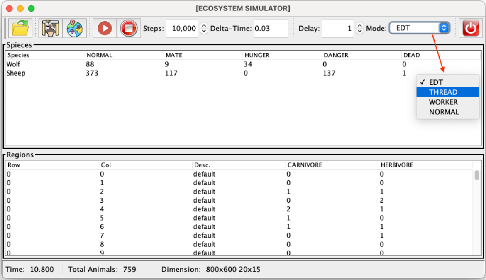

# Assignment 3: GUI Improvement using Threads

## Introduction

In assignment 2, we described two approaches to implement the functionality of the [run](run.png) and [stop](stop.png) buttons:

1.  In the first one, we used the Swing event queue to make the recursive call to **runSim**, and this way, between one call and another to `ctrl.advance(dt)`, Swing can update the view and handle user interactions.

2.  In the second one, we suggested changing the **runSim** method to simply call `ctrl.advance(dt)` `n` times, in which case the view remains blocked while the simulator is running and we only see the final result.

Although we achieved a reasonable behavior with the first approach considering responsiveness, we can improve it by using multithreaded programming, which is what we will do in this practice.

## Using Threads in Java to Provide Responsiveness in the GUI

Change the control panel to include a new **JSpinner** *Delay* (with a minimum value of 0, maximum value of 1000, and step size of 1) and a corresponding label. Its value represents a delay between consecutive simulation steps, since execution will now be faster.

Change the **runSim** method to include a second parameter **delay** of type **int**, and then change its body to something similar to the following pseudocode:

```java
while ( n > 0 && (the current thread has not been interrupted) ) {
  // 1. execute the simulator one step, i.e., call method
  //    _ctrl.advance(dt) and handle exceptions if any
  // 2. sleep the current thread for 'delay' milliseconds
  n--;
}
```

This loop executes `n` simulation steps, but it stops if the corresponding thread has been interrupted. In step 1, it executes the simulator for a single step and catches any exception thrown by the simulator/controller, presents it to the user using a dialog box, and exits the `runSim` method immediately (like in assignment 2). In step 2, it uses `Thread.sleep` to sleep the current thread for *delay* milliseconds.

Remember that if a thread is interrupted while sleeping, the interrupted flag is not set to `true`, but an exception is thrown. Therefore, in such a case, the current thread must be interrupted again when catching the corresponding exception to exit the loop (or simply exit the method with `return`).

Next, change the functionality of the [run](run.png) and [stop](stop.png) buttons to execute **runSim** in a new thread as follows:

  * Add a new attribute called **thread** of type `java.util.Thread` to the **ControlPanel** class, and make it **volatile** since it will be modified from different threads.

  * When [run](run.png) is clicked, disable all buttons except [stop](stop.png) and create a new thread (assign that reference to **thread**) that will do the following:
    (1) Call **runSim** with the number of steps and the delay specified in the corresponding **JSpinner** components.
    (2) Enable all buttons, i.e., when the call to **runSim** finishes.
    (3) Assign `null` to the `thread` attribute.

  * When [stop](stop.png) is clicked, if there is a running thread, i.e., if **thread** is not `null`, then interrupt it to exit the `while` loop and thereby terminate the thread.

Note that the same functionality can be implemented using the **stopped** attribute, which we used in assignment 2, instead of thread interruption. In that case, **stopped** must be declared as **volatile**. However, we want you to practice thread interruptions, so do not use a solution based on the **stopped** attribute (remove this field from the **ControlPanel** class).

Change the observer methods, in all view classes, so that every time a field or a Swing component is modified, it is done using `SwingUtilities.invokeLater`. This is necessary since the observer methods now run in a different thread than the Swing thread. The same must be done when showing error messages in the **runSim** method.

## Optional

Implement the functionality described in the previous section using a **SwingWorker** instead of creating a new thread every time  is clicked. You can maintain the 3 implementations (the one of assignment 2, the one with a thread, and the one with a Swing Worker) and allow choosing one using a combox box.




